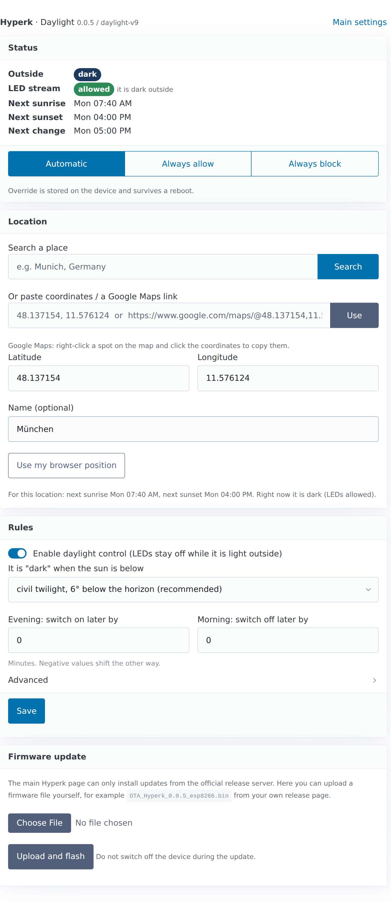

# Hyperk with daylight control

**A fork of [Hyperk](https://github.com/awawa-dev/Hyperk) that keeps the ambient light off during the day.**

The LED strip behind your TV is welcome at night and pointless at noon. This fork works out sunrise and sunset from coordinates you enter once, and lets the HyperHDR picture stream reach the LEDs only while it is dark outside. Everything else about Hyperk stays as it is.

- Location by place name, by coordinates pasted from Google Maps, or typed in by hand
- Choose when it counts as dark, from sunset down to astronomical twilight, and shift either edge by minutes
- Settings page in the style of the existing interface, on port 8080, plus a firmware upload the stock interface does not offer
- Falls back to normal behaviour whenever the time or the location is missing, so it cannot leave you in the dark

[Jump to the details](#daylight-control) · [Download the firmware](../../releases)



## Daylight control

This fork teaches Hyperk one rule: **the LED strip only follows the TV when it is actually dark outside.**

The device fetches the time over NTP and calculates sunrise and sunset for the coordinates you configure. At night the HyperHDR stream passes through untouched. During the day it is discarded, the firmware sees no signal and switches the LEDs off after the usual stream timeout.

The clock comes from the network. The device asks a time server, `pool.ntp.org` by default, and keeps nothing but UTC. It never learns a time zone and never needs one, because sunrise and sunset are computed in UTC from your coordinates and compared against UTC. The same firmware therefore works anywhere on earth without being told where "here" is. The settings page converts the times to the time zone of whoever is reading.

It is a filter, not a light switch. The LEDs light up because HyperHDR sends a picture, so the TV has to be running. With the TV on, the strip comes to life within about five seconds of nightfall and goes dark again a few seconds after sunrise. With the TV off nothing happens either way. Nothing is sent to any server: the sun position is computed on the device from your coordinates and the clock.

### Settings page

Open `http://hyperk.local:8080/`, or `http://<device-ip>:8080/`. It uses the same styling as the main Hyperk interface and shows the running firmware version in its header.

| Card | What you do there |
| :--- | :--- |
| Status | See whether it is dark, whether the stream is allowed, and the next sunrise and sunset in your local time. Three buttons force the gate open or shut for testing. |
| Location | Search a place by name, paste coordinates copied from Google Maps such as `48.137154, 11.576124`, paste a whole Maps link, or type latitude and longitude. A preview shows the resulting sun times before you save. |
| Rules | Switch the whole feature on, pick when it counts as dark, and shift both edges by minutes. |
| Firmware update | Pick a `.bin` file and flash it. The stock interface on port 80 cannot do this, it only installs releases from the upstream project. |

The place search runs in your browser against the free Open-Meteo geocoding service, so the device itself needs no internet access beyond NTP.

**When it counts as dark** is configurable. The default is civil twilight, six degrees below the horizon, which is roughly half an hour after the sun sets. Sunset itself, nautical and astronomical twilight are also offered, and the two offset fields shift each edge by up to six hours in either direction.

### Good to know

- Set the static colour in the main interface to black, otherwise the LEDs show that colour instead of going dark during the day.
- Without a time sync or without a location the firmware stays out of the way and the LEDs behave exactly as before.
- Only the network stream is gated. USB serial streaming and switching the device on through Home Assistant are unaffected.
- Built for ESP8266 and ESP32 boards with the async web server. On the ESP32-S2 and the Pico the feature is compiled out and those boards behave exactly as before.

### Programmable interface

| Request | Answer |
| :--- | :--- |
| `GET /api/daylight` | Status as JSON. Add `?at=<unix epoch>` to ask what the rule would do at another moment, or `?lat=&lon=&altitude=` to try a location without saving it. |
| `POST /api/daylight` | Takes the same fields as ordinary form parameters, for example `override=block` or `lat=48.14&lon=11.58`. |
| `GET /api/ping` | Answers `ok`. Useful to check that the device responds at all. |
| `POST /update` | Takes a firmware file as a normal file upload. |

### Installing it the first time

The interface on port 80 belongs to the upstream project and offers no file picker, so the very first install needs one of these two routes.

**Over the network.** The device does accept an upload on its own `/ota` address, the interface simply never offers it. Download `OTA_Hyperk_<version>_esp8266.bin` from the release page and send it, replacing the address with your device and the size with the real byte size of the file you downloaded:

```
curl -F "update=@OTA_Hyperk_0.0.5_esp8266.bin;filename=firmware.bin" \
     -H "hyperk-ota-firmware-name: OTA_Hyperk_0.0.5_esp8266.bin" \
     -H "hyperk-ota-firmware-size: 493264" \
     http://hyperk.local/ota
```

The file name must contain the board name, `esp8266`, and the size must match the file exactly, otherwise the device rejects it.

**Over USB.** Take `Hyperk_<version>_esp8266.bin` and write it to address `0x0`, either with `esptool` or with the browser based tool at [espressif.github.io/esptool-js](https://espressif.github.io/esptool-js/). Do not erase the flash first, that would wipe your WiFi credentials and LED configuration.

```
esptool --chip esp8266 --port /dev/ttyUSB0 write_flash 0x0 Hyperk_0.0.5_esp8266.bin
```

Afterwards every update goes through the **Firmware update** card on `http://hyperk.local:8080/`.

### Building a release

Change the first line of `.github/daylight-release-tag` to a new tag such as `daylight-v7` and push. The workflow builds **every supported board**, the ESP8266, the whole ESP32 family, the custom boards and the Pico, and publishes them together under **Releases**. Pushing a tag named `daylight-v*` or starting **Actions → Release Daylight Firmware → Run workflow** does the same.

> [!NOTE]
> The **ESP32-C2** is currently not built. It is the only board PlatformIO compiles through ESP-IDF, and that builder is incompatible with SCons 4.9 and newer, so the link step fails with `No module named 'SCons.Tool.FortranCommon'`. The cause is upstream, not in this code, and pinning an older SCons did not help. The board is left out of both workflows for now. To try it again, add a group with `boards: "esp32c2"` back to the matrix in `.github/workflows/build.yml` and `release.yml`.

Each board ships as `OTA_Hyperk_<version>_<board>.bin` for updates over the network and `Hyperk_<version>_<board>.bin`, a `.uf2` on the Pico, for a first flash over USB. ESP32 boards additionally get a `_factory.bin` that contains the bootloader and partition table for a completely empty chip.

---

The rest of this page documents Hyperk itself and is taken from the upstream project.

## Hyperk

Hyperk is a minimalist, high-performance uni-platform WiFi/Ethernet LED driver for ESP8266, ESP32 (S2, S3, C2, C3, C5, C6), Raspberry Pi Pico W (RP2040, RP2350). Designed as a lightweight and streamlined component that avoids unnecessary complexity, it delivers low‑latency performance and integrates smoothly with platforms such as HyperHDR, while offering essential home‑automation capabilities through a clean, modern codebase.

## Installation

The firmware can be flashed directly from your browser:
**[hyperk.hyperhdr.org](https://hyperk.hyperhdr.org)**

> [!TIP]
> Once installed, you can also perform OTA updates directly through the local **Web GUI**.
> That page installs releases of the upstream project only. To put **this fork** on a
> device, follow [Installing it the first time](#installing-it-the-first-time).

---

## Supported Hardware

- **Espressif:** ESP8266, ESP32, ESP32-S2, ESP32-S3, ESP32-C2, ESP32-C3, ESP32-C5, ESP32-C6, WT32-ETH01
   - Initial support for custom boards: GLEDOPTO, DOMRAEM, Athom/IoTorero including LAN8720 chipset  
   
- **Raspberry Pi Pico W:** RP2040, RP2350

Includes support for multi-segment (board-dependent), power-relay control, and HyperSerial (USB serial port communication).

## Supported LED Types

- **NeoPixel RGB:** WS2812b and compatible.
- **NeoPixel RGBW:** SK6812 (includes white channel calibration known from HyperSerial).
- **DotStar SPI:** APA102 and high-speed clocked LEDs.

## Manual

👉 [https://wiki.hyperhdr.eu/Hyperk](https://wiki.hyperhdr.eu/Hyperk)

## Integration

- **HyperHDR WiFi:** Dedicated Hyperk driver. Also works via its native `DDP`, `udpraw`, and `WLED` drivers.
- **HyperHDR Serial Port:** HyperHDR Adalight USB serial communication variant (AWA protocol).
- **Home Assistant:** Automatic discovery with support for power on/off, color, and brightness control.

|      HyperHDR      |   Home Assistant   |
|--------------------|--------------------|
| [](https://github.com/user-attachments/assets/ab252845-50da-4985-96be-d1da7bfd522d) | [](https://github.com/user-attachments/assets/b3097b11-249a-4a66-9cff-bcdd70f28e87) |


## Network Services

| Service | Port | Protocol / Description |
| :--- | :--- | :--- |
| Web GUI | 80 | Device configuration |
| UDP DDP | 4048 | DDP listener |
| UDP RealTime | 21324 | Real-time stream listener |
| UDP Raw RGB | 5568 | Raw color stream listener |
| Daylight UI | 8080 | Location based day/night control (this fork) |
  
<small>LEDs turn off automatically 6.5s after stream loss.</small>

---
*Developed for performance. Optimized for HyperHDR. [Privacy & Technical Note](https://awawa-dev.github.io/hyperk/privacy.html)*
